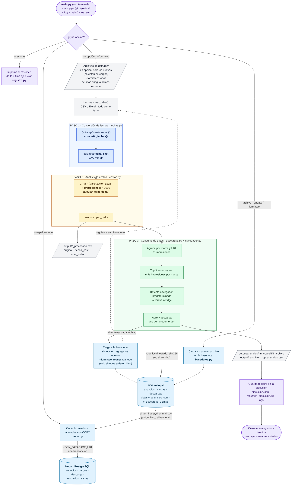

# Pipeline Admetricks

[](https://github.com/Chris132435/prueba_1/actions/workflows/pruebas.yml)

Pipeline en Python para procesar exportaciones de anuncios digitales (CSV o Excel) y dejar los
resultados listos para el análisis.

## Qué hace

1. **Fechas:** normaliza la columna `Fecha` en una nueva columna `fecha_cast` con formato `yyyy-mm-dd`.
2. **Costos:** calcula el CPM de cada fila, `(Valorización Local / Impresiones) × 1000`, y agrega
   `cpm_delta`: la diferencia con el CPM promedio de la misma marca en el mismo mes.
3. **Anuncios:** identifica los 3 anuncios con más impresiones de cada marca y descarga el archivo
   de su columna `Advertisement`.

Además:

- Guarda los datos en una base **SQLite** local y, opcionalmente, los respalda en **PostgreSQL**.
- Procesa automáticamente los archivos nuevos que se agregan a la carpeta de datos.
- Registra cada ejecución y muestra un resumen.



## Requisitos

- Python 3.12 o 3.13
- Brave o Microsoft Edge (para las descargas con navegador)

## Instalación

```bash
git clone https://github.com/Chris132435/prueba_1.git
cd prueba_1
python -m venv .venv
source .venv/bin/activate        # Windows: .venv\Scripts\activate
pip install -r requirements.txt
```

## Configuración

Copia `.env.ejemplo` como `.env` y completa los valores:

| Variable | Uso |
|---|---|
| `ADMETRICKS_DB` | Ruta de la base SQLite local (opcional; por defecto `data/admetricks.db`) |
| `NEON_DATABASE_URL` | Conexión PostgreSQL para el respaldo en la nube (opcional) |

El archivo `.env` no se sube al repositorio.

## Uso

Coloca los archivos de datos (CSV o Excel) en `data/raw/` y ejecuta:

| Comando | Acción |
|---|---|
| `python main.py` | Procesa los archivos nuevos, los carga a la base y respalda en la nube |
| `python main.py --formateo` | Reemplaza la base con todos los archivos de `data/raw/` |
| `python main.py --ultimo` | Vuelve a procesar el archivo más reciente |
| `python main.py ruta/archivo.csv` | Procesa un archivo específico |
| `python main.py --respaldo-nube` | Copia la base local a PostgreSQL |
| `python main.py --resume` | Muestra el resumen de la última ejecución |
| `python main.py --help` | Lista todas las opciones |

En Windows, `main.pyw` ejecuta el proceso sin abrir una terminal.

## Resultados

Se generan en `output/`:

- `<archivo>_procesado.csv`: datos originales con `fecha_cast` y `cpm_delta`
- `<archivo>_top_anuncios.csv`: anuncios seleccionados y estado de cada descarga
- `<archivo>_resumen_cpm.csv`: CPM por mes y marca
- `anuncios/`: archivos descargados
- `logs/` y `resumen_ejecucion.txt`: registro de las ejecuciones

## Estructura

```
admetricks_pipeline/   código del pipeline
docs/diagramas/        diagramas del proceso
sql/                   esquema y consultas de ejemplo
tests/                 pruebas automáticas
data/raw/              archivos de entrada
main.py / main.pyw     puntos de entrada
```

## Pruebas

```bash
pip install -r requirements-dev.txt
pytest
```

Las pruebas también corren en GitHub Actions en cada cambio (Linux y Windows).

## Diagramas

| Diagrama | Contenido |
|---|---|
| [Pipeline general](docs/diagramas/01_pipeline_general.png) | Flujo completo |
| [Paso 1 · Fechas](docs/diagramas/02_paso1_fechas.png) | Conversión de fechas |
| [Paso 2 · Costos](docs/diagramas/03_paso2_costos.png) | Cálculo de CPM y `cpm_delta` |
| [Paso 3 · Selección](docs/diagramas/04_paso3_seleccion.png) | Top 3 anuncios por marca |
| [Paso 3 · Descarga](docs/diagramas/05_paso3_descarga_navegador.png) | Descarga con navegador |
| [Ejecución y resumen](docs/diagramas/06_ejecucion_y_resume.png) | Ejecución sin terminal y `--resume` |
| [Próximos pasos](docs/diagramas/07_proximos_pasos.png) | Evolución del proyecto |
| [Base de datos](docs/diagramas/08_base_datos.png) | Carga a SQLite |
| [Respaldo en la nube](docs/diagramas/09_respaldo_nube.png) | Copia a PostgreSQL |

## Contribuir

1. Haz un fork del repositorio y crea una rama para tu cambio.
2. Verifica que las pruebas pasen con `pytest`.
3. Abre un pull request describiendo el cambio.
