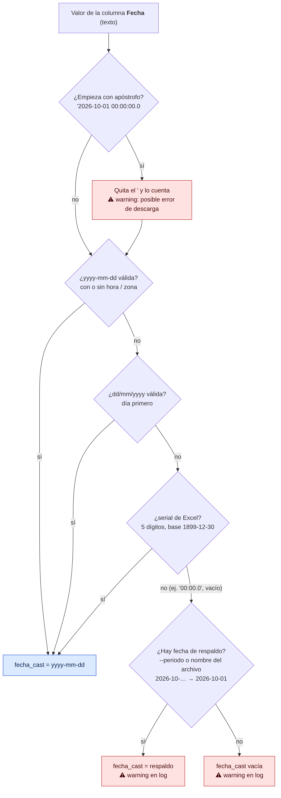
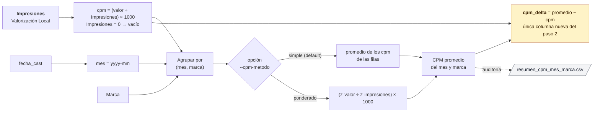
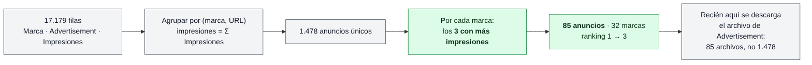
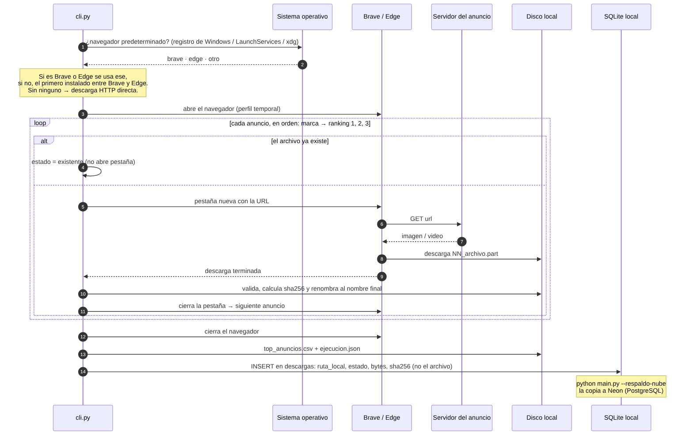
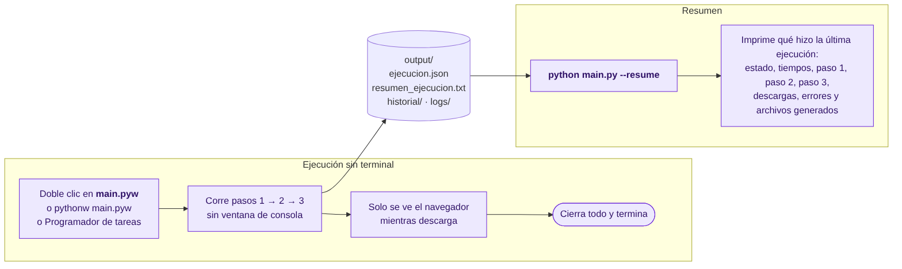
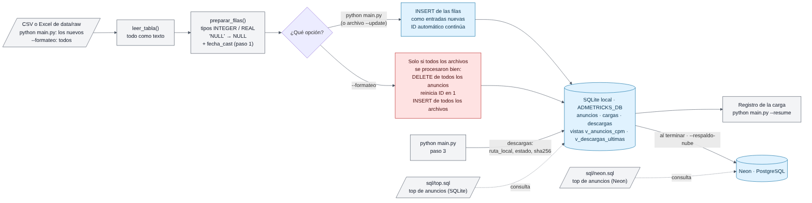
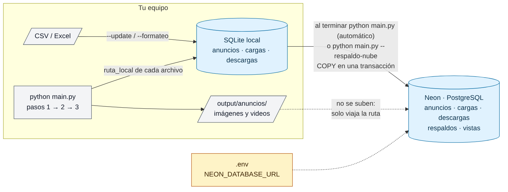
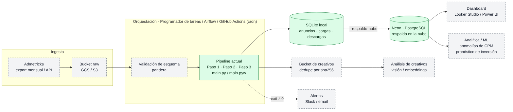

# Pipeline Admetricks

[](https://github.com/Chris132435/prueba/actions/workflows/pruebas.yml)

Proceso automatizado en Python que toma un export CSV de Admetricks y resuelve tres tareas, más
dos procesos de operación:

| Paso | Tarea | Resultado |
|---|---|---|
| **1** | Conversión de fechas | Columna `fecha_cast` con `Fecha` en formato `yyyy-mm-dd` (quitando el `'` inicial si viene) |
| **2** | Análisis de costos | Columna `cpm_delta` = CPM promedio del mismo mes y marca − CPM de la fila, con CPM = `(Valorización Local / Impresiones) × 1000` |
| **3** | Consumo de datos | Identifica los **3 anuncios con más impresiones de cada marca** y descarga el archivo de su columna `Advertisement` (uno por uno, con Brave o Edge) |
| Final 1 | Ejecución sin terminal | `main.pyw`: corre todo sin abrir consola y no deja nada abierto |
| Final 2 | Resumen | `python main.py --resume`: qué hizo la última ejecución |
| Base de datos | SQLite local | Los archivos nuevos se cargan solos; `--formateo` reemplaza todo con los archivos de `data/raw`; cada descarga queda registrada con su ruta local |
| Nube | Neon (PostgreSQL) | `--respaldo-nube` copia la base local a la nube (sin imágenes ni videos) |

**Contenido**

- [Uso rápido](#uso-rápido)
- [Arquitectura del pipeline](#arquitectura-del-pipeline)
- [Implementación por paso](#implementación-por-paso)
- [Procesos finales: sin terminal y --resume](#procesos-finales-sin-terminal-y---resume)
- [Base de datos SQLite: --update y --formateo](#base-de-datos-sqlite---update-y---formateo)
- [Respaldo en la nube (Neon)](#respaldo-en-la-nube-neon)
- [Validación en un equipo local](#validación-en-un-equipo-local)
- [Resultados con los datos de prueba](#resultados-con-los-datos-de-prueba)
- [Herramientas utilizadas](#herramientas-utilizadas)
- [Calidad y pruebas](#calidad-y-pruebas)
- [Preguntas técnicas frecuentes](#preguntas-técnicas-frecuentes)
- [Próximos pasos](#próximos-pasos)
- [Estructura del repositorio](#estructura-del-repositorio)

---

## Uso rápido

Requisitos: **Python 3.12 o 3.13** y **Brave o Microsoft Edge** instalado (Edge viene con
Windows).

```bash
python -m venv .venv
.venv\Scripts\activate            # Windows  (macOS/Linux: source .venv/bin/activate)
pip install -r requirements.txt   # versiones exactas; no hace falta `playwright install`

python main.py                    # procesa los archivos nuevos de data/raw, los carga y respalda en Neon
python main.py ruta\archivo.csv   # procesa ese archivo
python main.py --resume           # resumen de la última ejecución
python main.py --update           # agrega el archivo a la base SQLite (filas nuevas)
python main.py --formateo         # reemplaza la base con los archivos de data/raw (pasos 1-3 + nube)
python main.py --respaldo-nube    # copia la base local a Neon
```

**Configuración (`.env`):** copia `.env.ejemplo` como `.env` y completa la ruta de tu base local
(`ADMETRICKS_DB`) y la conexión a Neon (`NEON_DATABASE_URL`). Con eso no hace falta escribir
`--db` en cada comando. `.env` no se sube a git.

Acepta archivos **CSV** (separados por `,` o `;`) y **Excel** (`.xlsx`).

**Sin terminal (Windows):** doble clic en `main.pyw` (o `pythonw main.pyw`, o programarlo en el
Programador de tareas). Ver [procesos finales](#procesos-finales-sin-terminal-y---resume).

| Opción | Para qué |
|---|---|
| `--resume` | Muestra el resumen de la última ejecución y termina |
| `--update` | Agrega todas las filas del archivo a la base SQLite como entradas nuevas y termina |
| `--formateo` | Sin archivo: procesa **todos** los archivos de `data/raw` (pasos 1-3), borra la base, reinicia el ID, los carga y respalda en Neon. Con archivo: solo borra y recarga ese archivo en la base |
| `--db RUTA` | Base SQLite a usar (default: `ADMETRICKS_DB` del `.env`, o `data/admetricks.db`) |
| `--respaldo-nube` | Copia la base SQLite local a Neon (PostgreSQL) y termina |
| `--neon-url URL` | Conexión a Neon (default: `NEON_DATABASE_URL` del `.env`; mejor no escribirla en la terminal) |
| `--sin-bd` | No registrar las descargas en la tabla `descargas` |
| `--sin-nube` | Al terminar `python main.py`, no respaldar en Neon |
| `--salida DIR` | Carpeta de resultados (default `output/`) |
| `--entrada DIR` | Dónde buscar el CSV/Excel si no se indica (default `data/raw/`) |
| `--periodo 2026-10` | Fecha de respaldo para filas sin fecha (default: se toma del nombre del archivo) |
| `--cpm-metodo simple\|ponderado` | Cómo se promedia el CPM del mes y marca |
| `--top 3` | Anuncios con más impresiones a descargar por marca |
| `--candidatos N` | Opcional (desactivado por defecto): antes de elegir el top, limitar cada marca a sus N URLs más repetidas |
| `--alcance marca\|global` | Elegir el top por marca (default) o sobre todo el archivo |
| `--navegador auto\|brave\|edge` | `auto`: el predeterminado si es Brave o Edge; si no, el que esté instalado |
| `--navegador-oculto` | Descarga con el navegador sin mostrar su ventana |
| `--modo-descarga http` | Descarga directa por HTTP en paralelo, sin navegador |
| `--timeout` / `--reintentos` | Tolerancia a fallas de red |
| `--ultimo` | Vuelve a procesar el archivo más reciente de `data/raw` aunque ya se haya cargado (sin cargarlo de nuevo) |
| `--sin-descargas` | Solo calcula columnas y selección |
| `--sobrescribir` | Vuelve a bajar archivos que ya existen |

**Resultados** (en `output/`):

| Archivo | Contenido |
|---|---|
| `<archivo>_procesado.csv` | El CSV original + **`fecha_cast`** + **`cpm_delta`** (solo esas dos columnas nuevas) |
| `<archivo>_top_anuncios.csv` | Anuncios elegidos (marca, ranking, URL, repeticiones, impresiones) y resultado de cada descarga |
| `anuncios/<marca>/<ranking>_<archivo>` | Los archivos descargados |
| `<archivo>_resumen_cpm.csv` | Auditoría del paso 2: CPM promedio, mínimo, máximo y deltas por mes y marca |
| `ejecucion.json`, `resumen_ejecucion.txt`, `historial/` | Registro de cada ejecución (lo que lee `--resume`) |
| `logs/pipeline.log` | Log detallado de todas las ejecuciones |

Códigos de salida: `0` todo bien · `1` alguna descarga falló · `2` la ejecución falló. Sirven para
que el Programador de tareas, cron o Airflow detecten problemas.

---

## Arquitectura del pipeline

Todo entra por `main.py` / `main.pyw`, que llaman a `admetricks_pipeline/cli.py · main()`. Ahí
se orquestan los pasos en secuencia. Cada paso vive en su propio módulo y es una función sobre un
`DataFrame`, así que se puede probar y reutilizar por separado.


**Dónde se ejecuta cada paso**

| Paso | Módulo · función | Se invoca en | Entrada | Salida |
|---|---|---|---|---|
| Inicio | [`main.py`](main.py) / [`main.pyw`](main.pyw) → `cli.main()` | [`cli.py:405`](admetricks_pipeline/cli.py#L405) | argumentos | código de salida |
| Archivos nuevos / formateo | [`basedatos.py`](admetricks_pipeline/basedatos.py) · `archivos_pendientes()`, `archivos_de_carpeta()`, `cargar_varios()` | [`cli.py:171-239`](admetricks_pipeline/cli.py#L171-L239) | carpeta `data/raw` | archivos aún no cargados, del más antiguo al más reciente |
| Lectura | [`lectura.py`](admetricks_pipeline/lectura.py) · `leer_tabla()` | [`cli.py:205`](admetricks_pipeline/cli.py#L205) | CSV o Excel | `DataFrame` (todo texto) |
| **1 · Fechas** | [`fechas.py`](admetricks_pipeline/fechas.py) · `convertir_fechas()` | [`cli.py:246-260`](admetricks_pipeline/cli.py#L246-L260) | `Fecha` | `fecha_cast` |
| **2 · Costos** | [`costos.py`](admetricks_pipeline/costos.py) · `calcular_cpm_delta()`, `detalle_cpm()` | [`cli.py:262-287`](admetricks_pipeline/cli.py#L262-L287) | `Impresiones`, `Valorización Local`, `Marca`, `fecha_cast` | `cpm_delta` |
| **3a · Selección** | [`descargas.py`](admetricks_pipeline/descargas.py) · `seleccionar_top_anuncios()` | [`cli.py:289-307`](admetricks_pipeline/cli.py#L289-L307) | `Marca`, `Advertisement`, `Impresiones` | 85 anuncios |
| **3b · Descarga** | [`navegador.py`](admetricks_pipeline/navegador.py) · `elegir_navegador()`, `descargar_con_navegador()` | [`cli.py:136-168`](admetricks_pipeline/cli.py#L136-L168) | anuncios elegidos | archivos + `<archivo>_top_anuncios.csv` |
| Registro | [`registro.py`](admetricks_pipeline/registro.py) · `guardar()`, `formatear()` | [`cli.py:405-441`](admetricks_pipeline/cli.py#L405-L441) | datos de la ejecución | `ejecucion.json`, resumen |
| Base de datos | [`basedatos.py`](admetricks_pipeline/basedatos.py) · `cargar()` | [`cli.py:364-373`](admetricks_pipeline/cli.py#L364-L373) | CSV o Excel | tabla `anuncios` en SQLite |
| Registro de descargas | [`basedatos.py`](admetricks_pipeline/basedatos.py) · `registrar_descargas()` | [`cli.py:321-328`](admetricks_pipeline/cli.py#L321-L328) | resultado del paso 3 | tabla `descargas` (ruta local) |
| Respaldo en la nube (`--respaldo-nube`) | [`nube.py`](admetricks_pipeline/nube.py) · `respaldar()` | [`cli.py:386-391`](admetricks_pipeline/cli.py#L386-L391) | base SQLite local | Neon (PostgreSQL) |
| Respaldo automático al final | `_respaldo_automatico()` → [`nube.py`](admetricks_pipeline/nube.py) · `respaldar()` | [`cli.py:342-361`](admetricks_pipeline/cli.py#L342-L361) | base SQLite local | Neon (PostgreSQL) |
| Soporte | [`columnas.py`](admetricks_pipeline/columnas.py) · `columna()`, `quitar_apostrofo()` | todos los pasos | nombres y valores | columna real, valor limpio |

---

## Implementación por paso

### Paso 1 · Conversión de fechas (`fechas.py`)



- **Apóstrofo inicial.** Si el valor viene como `'2026-10-01 00:00:00.0`, se quita el `'` y la
  fecha se convierte normal. Esas filas se cuentan y quedan como warning en el log y en
  `--resume`, porque un `'` al inicio suele indicar un **error en la descarga o exportación**
  (el valor se guardó forzado como texto). También se toleran `’` y `‘`.
- Se prueba cada formato **en cascada y de forma vectorizada** (regex sobre toda la columna, no
  fila por fila): `yyyy-mm-dd` (con o sin hora/zona) → `dd/mm/yyyy` (día primero) → número de
  serie de Excel.
- Se toma la **fecha calendario tal como está escrita**, sin convertir zonas horarias.
- Fechas imposibles (`31/02/2026`) no se aceptan.
- Si la fila no trae fecha se usa una **fecha de respaldo** (opción `--periodo` o el periodo del
  nombre del archivo).

> ⚠️ **En el archivo de prueba actual** las 17.179 filas traen `Fecha = 00:00.0` (el CSV se
> guardó desde Excel con formato `mm:ss.0` y solo quedó la hora), así que todas toman
> `2026-10-01` del nombre `2026-10-Admetricks-…`. Con los nuevos datos dummy, que traen la fecha
> completa (con o sin `'`), se convierte la fecha real de cada fila.

### Paso 2 · Análisis de costos (`costos.py`)



```
cpm        = (Valorización Local / Impresiones) × 1000
promedio   = promedio del cpm de las filas del mismo mes (fecha_cast) y marca
cpm_delta  = promedio − cpm
```

Ejemplo del enunciado: CPM de la fila 5.84, promedio de la marca en enero 9.20 →
`cpm_delta = 9.20 − 5.84 = 3.36` (está como prueba automática).

- La base de impresiones es estrictamente la columna **`Impresiones`** (no `Impacto` ni
  `Ads Count`).
- La única columna que agrega el paso 2 al CSV es **`cpm_delta`**. Los valores intermedios (CPM
  de la fila y promedio del grupo) no se agregan al CSV; quedan para auditoría en
  `<archivo>_resumen_cpm.csv`.
- **Delta positivo** = la fila salió más barata que el promedio de su marca ese mes;
  **negativo** = más cara.
- El promedio se calcula con `groupby(...).transform()`: una sola pasada, sin `merge`.
- `--cpm-metodo simple` (default, el del enunciado): media de los CPM de las filas.
  `--cpm-metodo ponderado`: `(Σ valorización / Σ impresiones) × 1000`.
- Filas con 0 impresiones: `cpm_delta` vacío y no entran al promedio de su grupo.

### Paso 3 · Consumo de datos (`descargas.py` + `navegador.py`)

**3a · Selección, sin descargar nada.** Se identifican los anuncios usando solo los datos del
CSV; recién después se descargan los elegidos (85 archivos, no los 1.478).



1. Un **anuncio** es una URL única de `Advertisement`. El mismo anuncio aparece en varias filas
   (sitios, dispositivos…), así que se agrupa por (marca, URL) y se **suman sus `Impresiones`**.
2. Por cada marca se toman los **3 anuncios con más impresiones** (desempate: más
   apariciones, luego URL). Esto es exactamente lo que pide la tarea.
3. Una marca con menos de 3 anuncios devuelve los que tenga.

`--candidatos N` agrega un filtro previo opcional: limitar cada marca a sus N URLs más
repetidas antes de elegir el top. Está **desactivado por defecto** porque puede dejar fuera
anuncios que sí están entre los 3 con más impresiones (con `--candidatos 5`, 14 de los 85
cambian).

**3b · Descarga con el navegador.**



1. **Detecta el navegador predeterminado** del sistema: en Windows lee el registro
   (`UrlAssociations\https\UserChoice`); en macOS, LaunchServices; en Linux, `xdg-settings`.
2. Si es **Brave o Edge**, usa ese; si es otro (Chrome, Firefox…), usa el primero instalado
   entre Brave y Edge. Se puede forzar con `--navegador brave|edge`.
3. Abre el navegador con un **perfil temporal**: no toca tus pestañas, sesiones ni historial.
4. **En orden** (marca por marca, ranking 1 → 2 → 3) y de a uno:
   1. abre una pestaña con la URL;
   2. el propio navegador descarga el archivo;
   3. espera a que la descarga **termine**;
   4. valida el archivo, calcula su sha256 y lo guarda como `NN_archivo`;
   5. cierra la pestaña y **recién entonces pasa al siguiente**.
5. Al final cierra el navegador.

| Mecanismo | Para qué |
|---|---|
| Playwright con el ejecutable de Brave/Edge | Controla el navegador instalado (los dos son Chromium); no descarga navegadores propios |
| Descarga a `.part` y luego renombra | Nunca queda un archivo a medias con el nombre final |
| Archivos existentes se omiten | Idempotente: re-ejecutar solo baja lo que falta, sin abrir pestañas de más |
| Reintentos por anuncio | Un corte de red no tumba el lote |
| Solo `http(s)`, nombres saneados | Evita esquemas raros y *path traversal* (`../`) |
| Respaldo HTTP directo | Si no hay Brave ni Edge (o Playwright), descarga por HTTP en paralelo y lo deja registrado |

---

## Procesos finales: sin terminal y `--resume`



### 1 · Ejecución sin terminal

`main.pyw` hace exactamente lo mismo que `main.py`, pero Windows lo abre con `pythonw.exe`, que
**no crea ventana de consola**:

- Doble clic en `main.pyw`, o `pythonw main.pyw [archivo.csv]`.
- Para automatizarlo: Programador de tareas → Acción *Iniciar un programa* → Programa:
  `C:\ruta\.venv\Scripts\pythonw.exe`, Argumentos: `main.pyw`, Iniciar en: `C:\ruta\proyecto`.

Durante la ejecución solo aparece el navegador mientras descarga. Al terminar, el navegador se
cierra y el proceso termina, sin dejar ventanas abiertas. Como no hay consola, todo queda en
`output/logs/pipeline.log` y en el registro de la ejecución. Si algo falla, el error queda en el
registro y se ve con `--resume`.

### 2 · Resumen de la ejecución: `python main.py --resume`

Cada ejecución guarda `output/ejecucion.json` (más una copia en `output/historial/`) y
`output/resumen_ejecucion.txt`. `--resume` lee la última y muestra todo lo que hizo:

```text
════════════════════════════════════════════════════════════════
  RESUMEN DE LA EJECUCIÓN · Pipeline Admetricks
════════════════════════════════════════════════════════════════
Estado     : OK
Inicio     : 2026-10-08 01:07:56
Fin        : 2026-10-08 01:07:57  (0,59 s)

──────── ARCHIVO 1 de 1 ────────────────────────────────────────
Archivo    : data/raw/2026-10-Admetricks-Mascotas-Dummy.csv
Filas      : 17.179 · columnas: 26

PASO 1 · Conversión de fechas → columna fecha_cast
  Fechas convertidas desde la columna Fecha : 0
  Valores con apóstrofo inicial (') quitado : 0
  Sin fecha (ej. '00:00.0') → respaldo      : 17.179  (respaldo 2026-10-01)
  Formato no reconocido                     : 0
  Filas que quedaron sin fecha_cast         : 0
  Rango de fecha_cast                       : 2026-10-01 a 2026-10-01

PASO 2 · Análisis de costos → columna cpm_delta
  CPM = (Valorización Local / Impresiones) × 1000 · promedio simple por mes y marca
  Filas con CPM calculado    : 17.179
  Filas sin impresiones      : 0 (cpm_delta vacío)
  Meses · marcas             : 2026-10 · 32 marcas
  CPM mediana / promedio     : 46,48 / 90,95
  cpm_delta mínimo / máximo  : -9.686,96 / 1.379,72
  Fila más cara vs. su marca : purina (2026-10) cpm 10.981,91 vs. promedio 1.294,95

PASO 3 · Consumo de datos → descarga de anuncios
  URLs únicas en Advertisement               : 1.478
  Criterio: los 3 anuncios con más impresiones por marca
  Anuncios seleccionados                     : 85 de 32 marcas
  Descargado con el navegador                : edge (es el navegador predeterminado del sistema)
  Navegador predeterminado detectado         : edge
  Descargados / ya existían / con error      : 85 / 0 / 0
  ...
Archivos generados:
  csv_procesado         : output/2026-10-Admetricks-Mascotas-Dummy_procesado.csv
  ...
```

(Ejemplo con los datos de prueba. Las líneas de descarga muestran el formato que se espera con
Edge como navegador predeterminado.)

---

## Base de datos SQLite: `--update` y `--formateo`



```bash
python main.py                               # carga solos los archivos nuevos de data/raw (filas nuevas)
python main.py --formateo                    # reemplaza todo con los archivos de data/raw
python main.py data\raw\otro.xlsx --update    # agrega a mano ese archivo (sin pasos 1-3)
python main.py data\raw\otro.xlsx --formateo  # borra y recarga a mano solo ese archivo (sin pasos 1-3)
```

| Opción | Qué hace con la tabla `anuncios` |
|---|---|
| `python main.py` | Agrega los archivos **nuevos** de `data/raw` (ver [archivos nuevos](#archivos-nuevos-procesamiento-automático)). Es lo normal del día a día: ya no hace falta `--update`. |
| `--formateo` | **Reemplaza** los datos: deja en la base solo lo que hay en `data/raw`, con el `ID` desde 1. Sirve para pasar de datos dummy a reales o para corregir datos que estaban mal. |
| `--update` | Uso manual: inserta **todas** las filas de un archivo como entradas nuevas, aunque ya estén en la base (dos veces el mismo archivo = filas duplicadas con ID distintos). |

**`python main.py --formateo` paso a paso** (sin indicar archivo):

1. Toma **todos** los CSV/Excel de `data\raw\` (del más antiguo al más reciente; si dos tienen el
   mismo contenido, uno solo).
2. Ejecuta los **pasos 1, 2 y 3** de cada uno (columnas, descargas, registro de rutas).
3. Solo si **todos** se procesaron bien: en una sola transacción **borra** la tabla `anuncios`,
   **reinicia el ID** y **carga** todos los archivos.
4. **Respalda** en Neon, que queda igual a la base local.

Protecciones: si algún archivo falla, o si `data\raw\` está vacía, **no se borra nada** y la base
queda como estaba (el motivo aparece en `--resume`). La tabla `descargas` no se borra: es el
historial de lo descargado.

**Para pasar de datos dummy a reales:**

```powershell
# 1. Saca (o mueve a otra carpeta) los archivos dummy de data\raw
# 2. Copia los archivos reales en data\raw
python main.py --formateo
python main.py --resume
```

- **Todo o nada.** Cada carga es una sola transacción: si algo falla a mitad de un `--formateo`,
  no se borra nada y la base queda como estaba.
- **Después de un formateo**, los archivos cargados cuentan como procesados: la siguiente
  ejecución de `python main.py` solo toma los que lleguen después.
- **Trazabilidad.** Cada fila guarda `archivo_origen` e `id_carga`, y la tabla `cargas` registra
  fecha, modo, archivo, sha256 del archivo y filas leídas, insertadas y borradas. Así se puede
  saber o deshacer una carga puntual (`DELETE FROM anuncios WHERE id_carga = 5`).
- **Tu tabla actual sirve.** Si la base ya tiene la tabla `anuncios` creada con tu
  `CREATE TABLE`, el script le agrega las columnas que le falten (`fecha_cast`,
  `archivo_origen`, `id_carga`) sin tocar los datos. Si la base no existe, la crea.
- `--resume` también muestra el resultado de la última carga a la base.

### Esquema

Tu `CREATE TABLE` está bien planteado: las columnas son las del export y el `ID INTEGER PRIMARY
KEY AUTOINCREMENT` es la forma correcta de que SQLite asigne el ID solo y no reutilice números
borrados. Sobre esa base, el esquema recomendado ([`sql/esquema.sql`](sql/esquema.sql)) agrega:

| Cambio | Por qué |
|---|---|
| `"Omitible Video"` e `Impacto` como `INTEGER` | En el export siempre son enteros; así se pueden sumar y comparar sin conversiones |
| `"Duración de Video"` se queda `TEXT` | Trae valores como `1,0`, que no son un número válido para SQLite |
| `fecha_cast TEXT` (`yyyy-mm-dd`) | `Fecha` se guarda tal como viene; `fecha_cast` es la fecha limpia del paso 1, ordenable y compatible con `date()` / `strftime()` |
| `archivo_origen`, `id_carga` + tabla `cargas` | Saber de qué archivo y de qué carga vino cada fila |
| Índices `(Marca, fecha_cast)`, `Advertisement`, `id_carga` | Las consultas por marca, mes y anuncio no recorren toda la tabla |
| Vista `v_anuncios_cpm` | Calcula `cpm` y `cpm_delta` (paso 2) al consultar, con funciones de ventana |
| `'NULL'` del export → `NULL` real | Para usar `IS NULL` en las consultas (ej. `Etiquetas`) |

`cpm_delta` es una **vista** y no una columna porque depende del promedio de todo el mes y la
marca: si un `--update` agrega filas de ese mes, el promedio cambia y una columna guardada
quedaría desactualizada. La vista siempre está al día (y da el mismo resultado que el pipeline):

```sql
SELECT ID, Marca, mes, cpm, cpm_delta
FROM v_anuncios_cpm
WHERE Marca = 'purina' AND mes = '2026-10'
ORDER BY cpm_delta;
```

> Ojo: `--update` manual no evita repetidos: cargar dos veces el mismo archivo hace que esas filas
> cuenten dos veces en los análisis sobre la base. `python main.py` sí evita repetir archivos.
> Para reemplazar datos, usa `--formateo`.

---

## Respaldo en la nube (Neon)



### Descargas: solo la ruta, no el archivo

Cada `python main.py` agrega a la tabla **`descargas`** de la base local un registro por anuncio
seleccionado. Las imágenes y los videos se quedan en el disco (`output/anuncios/`) y **no se suben
a ninguna base**: solo se guarda dónde quedaron.

| Columna | Contenido |
|---|---|
| `id_ejecucion`, `fecha_ejecucion` | Qué ejecución del pipeline lo registró |
| `marca`, `ranking`, `advertisement`, `impresiones` | El anuncio elegido en el paso 3 |
| `estado` | `descargado`, `existente` (ya estaba en disco) o `error` |
| **`ruta_local`** | Ruta completa del archivo en el equipo (ej. `C:\Users\...\output\anuncios\purina\01_banner_x.jpg`); vacía si falló |
| `equipo` | Nombre del equipo donde está el archivo |
| `bytes`, `sha256` | Tamaño y huella para verificar el archivo |
| `error`, `modo`, `navegador` | Detalle de la descarga |

La vista `v_descargas_ultimas` muestra solo la última ejecución.

### `python main.py --respaldo-nube`

Copia las tablas `cargas`, `anuncios` y `descargas` de la base SQLite local a Neon:

1. Crea en PostgreSQL las tablas que falten, con las mismas columnas (y agrega columnas nuevas si
   el esquema local creció).
2. **En una sola transacción** vacía las tablas en la nube y copia todas las filas con `COPY`.
   Si algo falla (por ejemplo, se corta internet), la nube queda con el respaldo anterior.
3. Verifica que la nube tenga la misma cantidad de filas que la base local.
4. Crea las vistas `v_anuncios_cpm` (con `cpm_delta`) y `v_descargas_ultimas`, y registra el
   respaldo en la tabla `respaldos` (fecha, equipo y filas copiadas).

**Automático:** `python main.py` (y `main.pyw`, el programado) ejecuta este respaldo al
terminar, si `NEON_DATABASE_URL` está en `.env`. Si la nube falla, las descargas ya hechas se
conservan, el error queda en `--resume` y el código de salida es `1`. Para omitirlo una vez:
`python main.py --sin-nube`.

La nube queda como **espejo** de la base local: correrlo varias veces no duplica datos. Con los
datos de prueba copia las 17.179 filas en menos de un segundo contra un PostgreSQL local; por
internet depende de la conexión.

### Configurar la conexión

1. En la consola de Neon → **Connect** → copia la cadena de conexión.
2. Copia `.env.ejemplo` como `.env` en la carpeta del proyecto y pega la cadena en
   `NEON_DATABASE_URL`. Para el respaldo conviene la **conexión directa**: quita `-pooler`
   del host (`ep-xxxx-pooler.region...` → `ep-xxxx.region...`).
3. `python main.py --respaldo-nube` y `python main.py --resume` para ver el resultado.

> 🔒 La contraseña va solo en `.env`, que está en `.gitignore`. El script nunca la muestra: en
> los logs y en `--resume` aparece como `***`. No la escribas en el código ni en `--neon-url`
> (quedaría en el historial de la terminal).

Flujo completo sugerido:

```powershell
copy "C:\ruta\nuevos\*.csv" data\raw\   # 1. dejar los archivos nuevos en data\raw
python main.py                           # 2. cargarlos a la base, pasos 1-3 y respaldo en Neon
python main.py --resume                  # 3. ver el resumen
```

`python main.py --respaldo-nube` sigue disponible para respaldar en cualquier momento (por
ejemplo, después de un `--update` o `--formateo`).

### Archivos nuevos (procesamiento automático)

Basta con **copiar los archivos nuevos en `data\raw\`** (no en `data\`). La siguiente
ejecución de `python main.py` (o de la tarea programada) los detecta solos:

1. Busca en `data\raw\` los CSV/Excel que **todavía no se cargaron** a la base.
2. Los procesa **del más antiguo al más reciente**: pasos 1, 2 y 3 y, al terminar cada uno, lo
   carga a la base local (`anuncios` y `cargas`).
3. Al final hace **un solo respaldo** en Neon con todo.
4. Si no hay nada nuevo, no hace nada y termina con código 0 (ideal para la tarea programada).

**Cómo recuerda qué ya procesó:** por la **huella sha256 del contenido** de cada archivo, que
queda en la tabla `cargas`. Por eso:

| Situación | Qué pasa |
|---|---|
| Archivo nuevo | Se procesa y se carga |
| El mismo archivo con otro nombre | No se repite |
| Un archivo ya cargado pero con datos corregidos (contenido distinto) | Se procesa como nuevo y **se suma**. Para reemplazar: deja en `data\raw` solo los archivos correctos y usa `python main.py --formateo` |
| Un archivo que falla (por ejemplo, le falta una columna) | No se marca como cargado: se reintenta en la próxima ejecución; los demás siguen |
| Archivos cargados antes con `--update` | Ya cuentan como procesados |

| Comando | Qué archivo toma |
|---|---|
| `python main.py` | Todos los archivos nuevos de `data\raw\` |
| `python main.py --ultimo` | Solo el más reciente, aunque ya esté cargado (sin cargarlo de nuevo) |
| `python main.py ruta\archivo.csv` | Solo ese archivo (sin cargarlo a la base) |
| `python main.py --formateo` | **Todos** los de `data\raw\`: reemplaza la base con ellos |
| `python main.py archivo --update` / `--formateo` | Solo ese archivo, solo en la base (sin pasos 1-3) |

Cada archivo genera sus propios resultados (`<archivo>_procesado.csv`, `<archivo>_top_anuncios.csv`,
`<archivo>_resumen_cpm.csv`) y `--resume` muestra un bloque por archivo.

---

## Validación en un equipo local

El proyecto se ejecutó de punta a punta en un equipo local con **Windows** y funciona
correctamente:

| Componente | Cómo se usó |
|---|---|
| Python + entorno virtual (`.venv`) | `pip install -r requirements.txt` y `python main.py` desde PowerShell |
| Pasos 1, 2 y 3 | `python main.py` sobre el CSV de `data/raw`; descarga con el navegador del equipo |
| Base SQLite local | Creada con `sql/esquema.sql` y cargada con `python main.py --update --db "..."` (17.179 filas, ID 1 a 17179) |
| Cliente de base de datos | Conexión a la misma base SQLite desde la extensión de bases de datos de VS Code |
| Neon (PostgreSQL) | Conexión configurada en `.env` (`NEON_DATABASE_URL`), respaldo con `python main.py --respaldo-nube` |
| Consultas de comprobación | `sql/top.sql` (SQLite) y `sql/neon.sql` (Neon) para revisar el top de anuncios del paso 3 |

Además del uso real, las 53 pruebas automáticas cubren cada paso (ver
[Calidad y pruebas](#calidad-y-pruebas)).

---

## Resultados con los datos de prueba

| Métrica | Valor |
|---|---|
| Filas / columnas de entrada | 17.179 / 26 |
| Columnas agregadas | 2: `fecha_cast` y `cpm_delta` |
| Marcas | 32 |
| URLs únicas en `Advertisement` | 1.478 (11.613 filas de imagen `.jpg`, 5.566 de video `.mp4`) |
| Repeticiones por URL | mediana 1, máximo 371 |
| Top 3 por impresiones de cada marca | **85 anuncios** (25 marcas con 3, 3 con 2 y 4 con 1) |
| CPM (MXN) | mediana 46,48 · media 90,95 · mín 13,27 · máx 10.981,91 |
| Tiempo de los pasos 1-3 sin descargas | < 1 s |

---

## Herramientas utilizadas

| Herramienta | Uso en el proyecto | Por qué |
|---|---|---|
| **Python 3** | Lenguaje del pipeline | Estándar en datos, fácil de automatizar y desplegar |
| **pandas** | Lectura del CSV, fechas, `groupby`/`transform`, filtros | Operaciones vectorizadas: 17k filas en milisegundos |
| **Playwright** | Controlar Brave/Edge: abrir pestañas, descargar y esperar a que termine | API estable sobre el protocolo DevTools; funciona con el navegador ya instalado y sin consola (`pythonw`) |
| **winreg / plistlib / xdg-settings** | Detectar el navegador predeterminado | Librería estándar y herramientas del sistema, sin dependencias extra |
| **requests + urllib3 `Retry`** | Descarga HTTP de respaldo | Robusto, con reintentos y espera progresiva |
| **argparse / logging / json** (librería estándar) | CLI, log a archivo y registro de ejecuciones | Se integra con Programador de tareas, cron o Airflow sin cambios |
| **SQLite** (`sqlite3`, librería estándar) | Base local para `--update` / `--formateo` | Un solo archivo, sin servidor ni instalación; soporta funciones de ventana para `cpm_delta` |
| **openpyxl** | Lectura de archivos `.xlsx` | Motor estándar de pandas para Excel |
| **Neon** (PostgreSQL) + **psycopg 3** | Respaldo en la nube con `COPY` | PostgreSQL administrado y sin servidor; `COPY` copia miles de filas por segundo |
| **GitHub Actions** | Corre las pruebas en Linux (Chrome + PostgreSQL) y Windows (Edge) en cada push | Detecta errores antes de que lleguen a un equipo |
| **requirements.txt con versiones exactas** | Mismo entorno en cualquier equipo | Base para empaquetar en Docker |
| **python-dotenv** | Lee `.env` (ruta de la base y conexión a Neon) | Las credenciales quedan fuera del código y de git |
| **pytest** + `http.server` | 53 pruebas automáticas, servidor HTTP local | Prueba descargas reales (incluida la del navegador) sin depender de internet |
| **Mermaid** | Diagramas de este documento | Diagramas como código, versionados junto al código |
| **Git / GitHub** | Control de versiones | Historial y revisión de cambios |

**Lo que decidimos no usar (todavía) y por qué**

- **Selenium:** necesita un *driver* que coincida con la versión exacta de cada navegador.
  Playwright se conecta directo al Brave/Edge instalado.
- **`webbrowser` / `os.startfile`:** abren la URL, pero no permiten saber cuándo terminó la
  descarga ni dónde quedó el archivo, y una imagen o un video se muestran en lugar de
  descargarse.
- **Spark / Dask:** el volumen (≈10 MB por mes) cabe de sobra en memoria.
- **Base de datos / nube y machine learning:** no son necesarios para estos objetivos; son
  parte del [roadmap](#próximos-pasos).

---

## Calidad y pruebas

```bash
pip install -r requirements-dev.txt   # agrega pytest
pytest -q                              # 53 pruebas, ~10 s
```

**GitHub Actions** ([`.github/workflows/pruebas.yml`](.github/workflows/pruebas.yml)) corre
todas las pruebas en cada push:

| Entorno | Qué prueba además |
|---|---|
| Linux · Python 3.12 y 3.13 | Descarga real con Chrome y respaldo contra un PostgreSQL 16 desechable (no Neon) |
| Windows · Python 3.13 | Descarga real con **Edge**, como en el equipo de trabajo |

No usa credenciales: ni Neon ni contraseñas reales entran a GitHub.

- **Fechas:** formatos ISO, día primero, serial de Excel, zona horaria, fechas imposibles,
  **apóstrofo inicial** (`'`, `’`), `00:00.0` con y sin respaldo, periodo desde el nombre.
- **Costos:** el paso 2 agrega **solo** `cpm_delta`, ejemplo del enunciado (3.36), separación
  por mes, 0 impresiones, método ponderado, apóstrofo en `Impresiones`.
- **Selección:** top 3 por impresiones de cada marca (un anuncio con muchas impresiones gana
  aunque aparezca una sola vez), filtro opcional de repetidas y alcance global.
- **Navegador:** identificación de Brave/Edge en Windows, macOS y Linux, preferencia por el
  predeterminado y respaldo al instalado; **descarga real con un navegador Chromium**, en orden,
  con 404, archivos servidos como adjunto, idempotencia y sin `.part` residuales.
- **CLI:** de punta a punta, `--resume`, ejecución **sin consola** (simulando `pythonw`) y
  registro de fallos.
- **Base de datos:** `--update` agrega siempre filas nuevas (incluidas filas idénticas y el mismo
  archivo dos veces), `--formateo` borra y reinicia el ID en 1, un `--formateo` fallido no borra
  nada, `--formateo` sin archivo reemplaza la base con todos los archivos de la carpeta (y con un
  archivo roto o la carpeta vacía no borra nada), tabla creada con el `CREATE TABLE` original + Excel, y la vista da el mismo `cpm_delta`.
- **Descargas y nube:** la tabla `descargas` guarda rutas absolutas (no archivos), la vista de la
  última ejecución, `--sin-bd`, la contraseña nunca aparece, y contra un **PostgreSQL real**: el
  respaldo copia y verifica las tablas, no duplica al repetirse, calcula el mismo `cpm_delta` y un
  respaldo fallido deja la nube como estaba. Estas pruebas corren si se define
  `ADMETRICKS_PG_TEST_URL` (por ejemplo, con un PostgreSQL local o una rama de prueba de Neon).
- **Archivos nuevos:** procesa todos los nuevos en orden y los carga; la segunda ejecución no
  repite nada; una copia renombrada no se procesa; un archivo que falla queda pendiente sin frenar
  a los demás; `--ultimo` reprocesa el más reciente sin cargarlo.
- **Respaldo automático:** al terminar `python main.py` respalda en la nube; si Neon no está
  configurado lo omite; con `--sin-nube` no lo hace; si la nube falla, las descargas se conservan,
  el código de salida es 1 y la contraseña no aparece en el resumen.

> La prueba del navegador usa Chromium, el mismo motor de Brave y Edge. Antes de la
> presentación conviene correr una vez `python main.py` en el equipo con Brave o Edge.

---

## Preguntas técnicas frecuentes

<details>
<summary><b>¿Por qué Python + pandas y no Excel, SQL o Spark?</b></summary>

Excel no es automatizable ni reproducible, y de hecho fue lo que dañó la columna `Fecha`. SQL
requeriría montar una base solo para esto, y Spark es para volúmenes que no caben en una
máquina. Con pandas los pasos 1-3 corren en menos de un segundo y el código es testeable. La
lógica es la misma que en SQL (`GROUP BY` + funciones de ventana), así que migrarla a BigQuery
es directo.
</details>

<details>
<summary><b>¿Qué hacen con el apóstrofo (') al inicio de la fecha?</b></summary>

Se quita antes de convertir: `'2026-10-01 00:00:00.0` → `2026-10-01`. Pero no se ignora: se
cuenta, va como warning al log y aparece en `--resume` ("Valores con apóstrofo inicial"),
porque normalmente significa que el export forzó el valor como texto, es decir, un posible
error en la descarga del archivo. Si un mes aparece con muchos apóstrofos, hay que revisar
cómo se bajó.
</details>

<details>
<summary><b>¿Y si la columna Fecha viene como <code>00:00.0</code>?</b></summary>

Es la huella de un datetime guardado desde Excel con formato `mm:ss.0`: la fecha se perdió en
el archivo. El script usa el periodo del nombre del archivo (o `--periodo`), lo avisa en el log
y lo cuenta en `--resume`.
</details>

<details>
<summary><b>¿Por qué el CSV de salida solo agrega <code>fecha_cast</code> y <code>cpm_delta</code>?</b></summary>

Porque es lo que pide la tarea: el resto del CSV queda idéntico al original y las columnas
nuevas tienen exactamente esos nombres. Los cálculos intermedios (CPM por fila, promedio del
grupo) quedan para auditoría en `<archivo>_resumen_cpm.csv` y en `--resume`.
</details>

<details>
<summary><b>¿El CPM promedio es simple o ponderado?</b></summary>

Por defecto **simple**, porque así lo define el ejemplo del enunciado. Con
`--cpm-metodo ponderado` se usa `(Σ valorización / Σ impresiones) × 1000`, que evita que una fila
con pocas impresiones mueva el promedio. Es una decisión de negocio, por eso es configurable.
</details>

<details>
<summary><b>¿Cómo se eligen los 3 anuncios de cada marca?</b></summary>

Se decide **con los datos del CSV**, sin bajar nada: se agrupan las filas por (marca, URL de
`Advertisement`), se suman sus `Impresiones` y se toman las 3 URLs con más impresiones de cada
marca. Solo esos 85 archivos se descargan. Existe un filtro previo opcional
(`--candidatos N`, limitar a las N URLs más repetidas), pero está desactivado porque puede
excluir anuncios que sí están en el top 3 por impresiones.
</details>

<details>
<summary><b>¿Por qué descargar con el navegador y no con un script HTTP?</b></summary>

Es lo que pide el proceso: abrir cada anuncio en el navegador del usuario (Brave o Edge), uno
por uno y en orden, y esperar a que la descarga termine antes de pasar al siguiente. Además, el
navegador usa la misma red, certificados y proxy que el usuario. Para entornos sin navegador
(un servidor, por ejemplo) está `--modo-descarga http`, que descarga en paralelo, y el script
cae a ese modo solo si no encuentra Brave ni Edge.
</details>

<details>
<summary><b>¿Cómo sabe cuál es el navegador predeterminado?</b></summary>

En Windows lee `HKCU\Software\Microsoft\Windows\Shell\Associations\UrlAssociations\https\UserChoice`
(`ProgId` = `BraveHTML`, `MSEdgeHTM`, `ChromeHTML`…). En macOS lee las preferencias de
LaunchServices y en Linux usa `xdg-settings get default-web-browser`. Si el predeterminado es
Brave o Edge se usa ese; si no, el primero instalado de los dos, y el motivo queda en el
resumen.
</details>

<details>
<summary><b>¿Cómo sabe que una descarga terminó antes de pasar a la siguiente?</b></summary>

Playwright recibe el evento de descarga del navegador y `save_as()` bloquea hasta que el
navegador termina de escribir el archivo. Recién entonces se valida (tamaño, sha256), se
renombra, se cierra la pestaña y se abre la siguiente. Es secuencial a propósito.
</details>

<details>
<summary><b>¿Toca mi perfil de Brave/Edge, mis pestañas o mis cookies?</b></summary>

No. Se abre una instancia separada con un perfil temporal que se borra al cerrar. Funciona
aunque tengas el navegador abierto.
</details>

<details>
<summary><b>¿Cómo corre "sin terminal" y qué pasa si falla?</b></summary>

`main.pyw` se ejecuta con `pythonw.exe`, que no crea consola, y Playwright también oculta su
proceso auxiliar. El log va a un archivo (`output/logs/pipeline.log`); no se escribe en una
consola que no existe. Si algo falla, el error queda en `ejecucion.json` con estado `FALLÓ`,
el código de salida es `2` y se ve con `python main.py --resume`. Hay una prueba automática que
simula la ejecución sin consola.
</details>

<details>
<summary><b>¿Qué muestra <code>--resume</code>?</b></summary>

La última ejecución: estado, horario y duración, archivo procesado y, por paso, qué se hizo.
Paso 1: fechas convertidas, apóstrofos, respaldos y no reconocidas. Paso 2: método, filas con
CPM, rango de `cpm_delta` y la fila más cara. Paso 3: URLs, candidatas, seleccionadas,
navegador usado y por qué, descargados/errores, MB y los principales anuncios. Al final, los
archivos generados. Cada ejecución también queda en `output/historial/`.
</details>

<details>
<summary><b>¿Qué pasa si se cae la red a mitad de una descarga?</b></summary>

Se reintenta el anuncio (`--reintentos`). Si igual falla, el `.part` se borra, la fila queda con
`estado = error` en `<archivo>_top_anuncios.csv`, el proceso sigue con el siguiente y termina con código
1. Al volver a ejecutar, los archivos ya descargados se omiten y solo se reintentan los
faltantes.
</details>

<details>
<summary><b>¿Qué medidas de seguridad tiene?</b></summary>

Solo acepta URLs `http(s)`. El nombre del archivo se sanea (sin `../` ni caracteres especiales),
así que una URL no puede escribir fuera de la carpeta de destino. Las descargas tienen timeout,
el navegador usa un perfil aislado y no se ejecuta nada de lo descargado. Mejoras posibles:
lista blanca de dominios (`ads.admetricks.com`) y tamaño máximo por archivo.
</details>

<details>
<summary><b>¿Cómo validaron que los cálculos son correctos?</b></summary>

Con 53 pruebas automáticas (incluido el ejemplo 9.20 − 5.84 = 3.36) y una verificación de
`cpm_delta` contra un cálculo independiente sobre las 17.179 filas: la diferencia máxima fue de
1,8 × 10⁻¹², o sea, redondeo de punto flotante. Además, con promedio simple la suma de
`cpm_delta` por marca y mes da 0, como debe ser.
</details>

<details>
<summary><b>¿Por qué SQLite y cuál es la diferencia entre --update y --formateo?</b></summary>

SQLite es un único archivo, no necesita servidor y viene con Python. Alcanza de sobra para
decenas de millones de filas en un equipo. `--update` agrega todas las filas del archivo como
entradas nuevas con ID automático, aunque ya existan (en el día a día no hace falta: `python
main.py` carga solo los archivos nuevos). `--formateo` reemplaza todo: procesa los archivos de
`data/raw`, borra la base, reinicia el ID y los carga, para pasar de datos dummy a reales o
corregir datos. Las dos operaciones son una transacción: o se aplican completas o no se aplican,
y si un archivo falla, `--formateo` no borra nada. Si después se migra a Postgres o BigQuery,
el mismo esquema sirve casi sin cambios.
</details>

<details>
<summary><b>¿Dónde entraría machine learning?</b></summary>

No en estos pasos, porque son reglas exactas. Sí sobre el histórico: detección de CPM anómalos
(`cpm_delta` como señal), pronóstico de inversión por marca y análisis de los creativos
descargados (qué tipo de imagen o video se asocia a más impresiones).
</details>

---

## Próximos pasos



En verde lo que ya está hecho; con borde punteado, lo que sigue.

**Hecho:** pipeline completo ejecutado en un equipo local con Windows, base SQLite local con
`--update` / `--formateo`, registro de descargas con su ruta local y respaldo en Neon
(PostgreSQL) con `--respaldo-nube`.

**Fase 0 · Validación (inmediato)**

1. Correr el pipeline con los nuevos datos dummy (fecha completa, con o sin `'`) y revisar en
   `--resume` cuántas filas traían apóstrofo.
2. Probar la descarga también en los demás equipos donde se vaya a usar (Brave y Edge).
3. Confirmar con negocio el promedio de CPM (simple o ponderado).

**Fase 1 · Robustez**

4. Validación de esquema a la entrada con **pandera** (columnas, tipos, rangos): fallar temprano
   si el export cambia.
5. Empaquetar en **Docker** (modo HTTP o navegador sin ventana) para correr igual en cualquier
   entorno. Las pruebas en GitHub Actions y las versiones fijas ya están listas para eso.
6. Lista blanca de dominios y tamaño máximo en las descargas.

**Fase 2 · Automatización y almacenamiento**

7. Programar `main.pyw` en el **Programador de tareas** (mensual) o, si se suman fuentes, en
   **Airflow / Cloud Composer**.
8. Guardar el CSV crudo en un bucket (**GCS / S3**). La base ya se respalda en **Neon** al final
   de cada ejecución; si el volumen crece, particionar por mes.
9. Subir los creativos a un bucket, deduplicados por sha256.
10. Alertas por Slack o correo cuando el código de salida sea distinto de 0, con el texto de
    `resumen_ejecucion.txt`.
11. Si Admetricks ofrece API, reemplazar el export manual por una extracción automática.

**Fase 3 · Explotación de los datos**

12. Dashboard en **Looker Studio / Power BI**: CPM por marca y mes, share de impresiones y
    galería de los top creativos.
13. **Detección de anomalías** de CPM por marca (z-score robusto o Isolation Forest sobre
    `cpm_delta`).
14. **Pronóstico** de inversión e impresiones por marca con el histórico mensual.
15. **Análisis de creativos** con embeddings de imagen/video para relacionar el tipo de
    creativo con su desempeño.

---

## Estructura del repositorio

```
main.py                 # entrada con terminal:  python main.py [csv] | --resume
main.pyw                # entrada sin terminal (Windows, doble clic / pythonw)
requirements.txt        # versiones exactas para ejecutar (base del futuro Docker)
requirements-dev.txt    # + pytest, para las pruebas
requirements.in         # dependencias directas con rangos (de aquí se regenera requirements.txt)
.github/workflows/      # pruebas automáticas en GitHub Actions (Linux y Windows)
.env.ejemplo            # plantilla de configuración (copiar como .env, que no se sube a git)
admetricks_pipeline/
├── cli.py              # orquesta pasos 1 → 2 → 3, logs y registro
├── fechas.py           # Paso 1: fecha_cast
├── costos.py           # Paso 2: cpm_delta
├── descargas.py        # Paso 3a: top 3 por impresiones de cada marca + descarga HTTP de respaldo
├── navegador.py        # Paso 3b: detección de Brave/Edge y descarga uno por uno
├── registro.py         # registro de ejecuciones y texto de --resume
├── basedatos.py        # SQLite: esquema, --update y --formateo
├── lectura.py          # lectura de CSV (, o ;) y Excel
├── nube.py             # --respaldo-nube: copia SQLite → Neon (PostgreSQL)
└── columnas.py         # nombres de columna tolerantes y limpieza del apóstrofo
sql/
├── esquema.sql         # esquema SQLite de referencia
├── top.sql             # consulta del top de anuncios del paso 3 (SQLite local)
└── neon.sql            # la misma consulta para Neon (PostgreSQL)
tests/
└── test_pipeline.py
data/admetricks.db      # base SQLite local (se crea sola; no se sube a git)
data/raw/
└── 2026-10-Admetricks-Mascotas-Dummy.csv
docs/diagramas/         # diagramas: fuente .mmd + .png/.svg para la presentación
```

**Regenerar los diagramas** (requiere Node.js):

```bash
cd docs/diagramas
for f in *.mmd; do
  npx -y -p @mermaid-js/mermaid-cli@11.4.2 mmdc -i "$f" -o "${f%.mmd}.png" -b white -s 2
  npx -y -p @mermaid-js/mermaid-cli@11.4.2 mmdc -i "$f" -o "${f%.mmd}.svg" -b white
done
```
